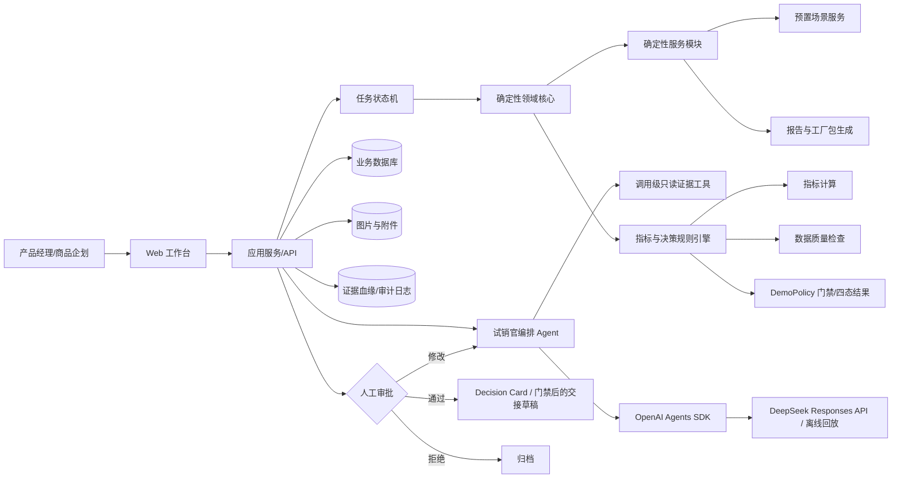

# 试销官 MVP 技术架构

> 项目：永嘉农商杯——AI Agent × 鞋服产业
> 产品暂名：试销官
> 文档状态：MVP 架构基线 v0.2（2026-09-03 决策冻结）

## 1. 架构目标

“试销官”不是“爆款预测器”，而是面向永嘉中小鞋企的新品快反决策 Agent。它将款式信息、经营约束和低成本试销数据，转换为可审计的 `GO / PIVOT / NO_GO / EVIDENCE_INSUFFICIENT` 四种结果，并仅在满足决策与审批门禁时生成打样和首单所需的结构化业务草稿。

MVP 优先解决以下闭环：

```text
新品需求录入
→ 候选款分析
→ 试销实验设计
→ 预置场景控制台生成每日聚合合成结果
→ 数据质量检查
→ 决策计算与解释
→ 人工审批
→ 输出 TechPack Lite、打样任务和首单三点情景
```

架构遵循以下原则：

1. **主办方痛点优先**：款式迭代慢、研发效率低、供应链协同繁琐、柔性生产不足等是需求基线；公开网络资料只作补充证据。
2. **规则负责边界，模型负责理解**：金额、阈值、置信区间、样本校验和状态流转使用确定性代码；大模型负责解析、规划、归纳和解释。
3. **证据先于结论**：每个结论必须能追溯到输入数据、计算过程、规则版本和人工审批。
4. **有限自治**：Agent 可以归一化 Brief、生成实验文字草案、发现信息缺口并解释锁定证据，但不能计算业务结果、自行审批、发布营销内容、产生实际订单或写入企业生产系统。
5. **先单体、后平台**：MVP 采用模块化单体，不为尚未发生的规模预建微服务。
6. **AI＋OPC**：系统应让一名 AI 产品经理完成原来需要商品企划、用户研究和数据分析多人协作的部分工作，但保留关键业务责任人的审批权。

## 2. 系统边界

### 2.1 MVP 范围内

- 结构化录入 1 个男士轻量休闲鞋基础款与 2 个配色变体
- 保存图片及人工填写的文本、价格、材料、颜色、尺码等商品属性；P0 不依赖自动视觉识别或相似款检索
- 生成低成本试销实验方案
- 通过预置场景控制台加载固定随机种子、每日聚合的 `SYNTHETIC` 曝光、点击、收藏、询单、加购和购买意向数据
- 检查样本量、数据完整性和异常值
- 计算试销指标、数据质量、证据等级和经营门禁
- 输出可解释的 `Go / Pivot / No-Go / Evidence Insufficient`
- 生成人工审批后的 TechPack Lite、打样任务和首单三个离散情景点（整体形成情景范围）
- 保存完整证据血缘和操作审计记录

### 2.2 MVP 范围外

- 不承诺新品“爆款预测准确率达到 90%—95%”
- 不训练鞋服行业基础大模型
- 不直接替代 ERP、PLM、MES、WMS 或电商平台
- 不自动创建真实采购单、生产单或广告投放任务
- 不直接爬取需要登录、受平台限制或未经授权的数据
- 不实现 CSV/Excel 上传、手工试销观测录入或平台 API 数据接入
- 不在缺乏企业真实数据时声称已验证商业收益
- 不在 MVP 阶段实现复杂多 Agent 分布式系统

## 3. 总体架构



MVP 只有一个“试销官”逻辑编排 Agent 角色。OpenAI Agents SDK 负责结构化模型调用；适配层可为各次调用创建短生命周期 SDK `Agent` 实例，但不形成多个业务 Agent，且所有调用均设置 `handoffs=[]`。Brief 归一化和实验文字草案不挂载工具；只有在线决策解释挂载一个调用级、无参数、只读的锁定证据工具。数据质量、指标、证据卡、四态决策、状态机、审批、首单与工厂交接由应用服务直接运行确定性代码。

## 4. 单 Agent 与受控模块

| 组件 | 实现性质 | 主要职责 | 自动化边界 |
|---|---|---|---|
| 试销官逻辑编排 Agent | 单一业务角色；每次调用可创建短生命周期 SDK `Agent` | Brief 归一化和缺失问题、实验计划文字草案、引用既有指标/证据的决策解释 | 只有在线决策解释挂载一个无参只读工具；不计算指标、不决定四态/ Pivot 变量、不审批、不写业务状态、不补造工艺参数，不使用 handoff |
| Brief 归一化 | Agent 结构化输出 | 对已通过 ProductBrief Schema 的表单快照生成摘要、决策问题和缺失问题 | 不写回或补全 Brief；图片只展示，材料、工艺和权属需人工确认 |
| 实验规划器 | 结构化输出＋模板 | 生成单主目标、单变量实验草案 | 实验执行和策略锁定前必须审批 |
| 场景控制台 | 确定性应用服务 | 按预置场景版本和随机种子生成每日聚合快照 | 无自由数据调参，无 CSV/手工/API 入口 |
| 数据质量与指标服务 | 确定性 Python 代码 | 执行 Schema、漏斗、样本、SRM、转化、毛利与约束计算 | 失败或阻断时不允许模型补算，不暴露为 Agent tool |
| 决策引擎 | 确定性应用服务 | 按锁定的 `DemoPolicy v1` 输出四种结果和规则轨迹 | 模型只解释，不选择类别 |
| 工厂交接生成器 | 确定性模板＋服务端门禁 | 按决策和审批状态生成草稿或拒绝生成 | 不向工厂发送，不创建真实订单，不暴露为 Agent tool |

## 5. 工作流与状态机

### 5.1 三个核心正交状态

不再使用一个枚举同时表示流程位置、数据质量、决策类别、审批和工具错误。核心业务状态只包含以下三个正交维度，详细枚举见 `docs/DATA_DICTIONARY.md`：

1. `workflow_state`：只表示主流程位置。

   ```text
   DRAFT
   → BRIEF_READY
   → PLAN_PROPOSED
   → PLAN_APPROVED
   → SIMULATION_READY
   → SIMULATION_RUNNING
   → DATA_READY
   ├→ DATA_VALIDATED → ANALYZED
   └→ DATA_BLOCKED ──→ ANALYZED
   → DECISION_PROPOSED
   ├→ DECISION_APPROVED
   │  ├→ HANDOFF_DRAFT_READY → ARCHIVED   (GO；或已批准精确修订的 Pivot；两者还需首单假设确认)
   │  └→ ARCHIVED                         (已批准 No-Go)
   └→ DATA_READY                           (Evidence Insufficient 要求补充证据)
   ```

   Evidence Insufficient 不能 `APPROVE` 进入交接；也可通过显式“取消活跃工作并归档”结束。契约预留 `NEEDS_INPUT / TOOL_FAILED / CANCELLED` 表达明确的待补充、工具故障或取消位置；P0 尚无将它们持久化为中间状态的独立接口。

2. `quality_status`：数据质量评估完成后只能为 `PASS / WARN / BLOCK`；评估前为 `null`。`BLOCK` 使 `decision_outcome` 只能为 `EVIDENCE_INSUFFICIENT`。
3. `decision_outcome`：评估完成后只能为 `GO / PIVOT / NO_GO / EVIDENCE_INSUFFICIENT`；评估前为 `null`。它是四种业务结果，不是流程状态。

审批不是第四个核心状态维度。每次审批是一条不可覆盖的 `Approval` 记录，包含 `gate`、`target_type`、`target_id`、`object_version`、`decision`、`actor`、`comment`、`request_id` 和 `created_at`；对象当前的 `approval_status` 只是投影字段。P0 的 `SimulationRun.status` 是项目 `workflow_state` 的稳定视图，不另造一套状态；`HandoffPackage.status` 只表达交接物自身状态。

决策批准和交接生成是同项目重放的硬边界。在边界之前，`SIMULATION_RUNNING / DATA_READY / DATA_VALIDATED / DATA_BLOCKED / ANALYZED / DECISION_PROPOSED` 可通过受幂等保护的重置操作回到 `SIMULATION_READY`；旧数据集转为非活跃，当前派生投影清空，而观测、对象版本和审计事件仍追加保留。

Brief 或 DemoPolicy 的新版本是另一条显式重开边。任何非 `ARCHIVED` 项目可创建新版本，依 Brief 完整性回到 `DRAFT` 或 `BRIEF_READY`，停用活跃数据集并清除当前计划及下游投影；旧对象版本、审批、观测和审计记录不删除。终态可直接归档；活跃项目必须带显式取消标记才能归档，`ARCHIVED` 后不可再修改。

不再使用 `BLOCKED`、`DATA_REJECTED`、`EXPERIMENT_REJECTED` 或 `DECISION_REJECTED` 这类混合语义状态。审批驳回由 `Approval` 记录并回退到明确的上一流程状态；质量是否阻断只看 `quality_status`，业务结论只看 `decision_outcome`。

### 5.2 关键质量门

1. **需求门**：品类、目标用户、目标价格、渠道、候选款和约束信息完整。
2. **实验门**：目标指标、样本、变量、预算、停止条件和合规检查明确。
3. **数据门**：场景、生成器、随机种子和快照哈希可追溯；Schema、漏斗、每臂样本与 SRM 通过。
4. **决策门**：结论引用有效证据，并显示不确定性与反例。
5. **执行门**：打样和首单输出必须经过人工批准。

任何状态维度变更都写入 `AuditEvent`，不得仅由前端修改状态。状态更新必须在后端事务内同时校验不变式。

## 6. 核心数据对象

字段事实来源是 Pydantic/OpenAPI，完整表见 `docs/DATA_DICTIONARY.md`。不同对象的审计字段并不相同，不能笼统宣称每个对象都有 `version/updated_at/created_by`。八类业务快照使用追加式 `ObjectVersionRecord`；Dataset、Observation、Approval、PivotRevision、AgentRun 和 AuditEvent 使用各自表保存历史。

### 6.1 项目与 Brief

`ProjectDetail` 是当前投影，包含 `id/name/scenario_id/status/workflow_state/data_status/data_origin/data_sensitivity_level/brief_version/brief/brief_missing_fields/first_order_assumptions_confirmation/experiment_plan/current_day/total_days/policy_version/policy_revision/current_policy/scenario_version/fixed_seed/generator_version/agent_mode/datasets/artifacts/created_at/updated_at`。其中 `status` 与 `workflow_state`、`data_status` 与 `data_origin` 是兼容性别名，不是额外状态维度。`data_sensitivity_level` 无附件时为 `SYNTHETIC_ONLY`，存在用户图片后为 `USER_CONTENT_RESTRICTED`，不改变试销来源。

`POST /projects` 接收名称和可缺省的 `ProductBriefDraft`。草稿字段允许为空；只有同一负载通过严格 `ProductBrief` 校验时进入 `BRIEF_READY`，否则保持 `DRAFT` 并返回 `brief_missing_fields[]`。`PUT /projects/{id}/brief-versions` 带 `If-Match-Version` 创建下一不可覆盖版本。

严格 Brief 包含产品名、基础款 ID、品类、人群、场景、季节、渠道、卖点、目标价/估算成本、毛利底线、MOQ、预计交期、上市窗口、试销/生产预算、经营目标、风险、至少两个内嵌 `CandidateVariant`、可选首单假设和 `data_status`。P0 服务端在创建与更新时强制 `data_status=SYNTHETIC`，拒绝客户端把未实现的数据适配器伪装成其他来源。P0 没有独立持久化的 `CandidateStyle/VariantVersion` 表；变体字段实际为 `id/label/color_name/color_hex/material_notes/image_url/target_price_fen`。未知鞋楦、材料或工艺不能由 Agent 补造，交接页统一显示“待确认”。

### 6.2 实验计划与策略

`ExperimentPlan` 包含 `id/version/approval_status/decision_question/hypotheses/controlled_variable/invariants/primary_metric/secondary_metrics/arms/target_audience/channel/duration_days/min_exposure_per_arm/min_intent_per_arm/budget_cap_fen/stop_rules/quality_requirements/potential_biases/policy_version/policy_snapshot/generated_by/generated_at`。每个 `ExperimentArm` 为 `id/label/variant_id/expected_share`；首版强制两臂 50/50，且臂 ID 与变体不可重复。

`DemoPolicy` 通过 `version/revision` 做乐观版本校验。新版本会失效当前计划与下游投影；ExperimentPlan 审批时校验并冻结 `policy_version + policy_snapshot`。计划自身的 `approval_status` 是当前投影，审批事实以追加式 `Approval` 为准。

### 6.3 场景、运行与每日观测

对外 `DemoScenarioSummary` 字段为 `id/name/description/expected_outcome/total_days/scenario_version/fixed_seed/generator_version`。`SimulationRun` 是以项目 ID 为 run ID 的当前视图：`id/project_id/experiment_plan_id/experiment_plan_version/status/current_day/total_days/dataset_id/scenario_id/scenario_version/fixed_seed/generator_version/schema_version/dataset_sha256`；`status` 直接使用项目流程状态。

`DatasetSummary` 包含 `id/project_id/data_status/source_label/authorization_note/file_name/sha256/schema_version/row_count/scenario_id/scenario_version/fixed_seed/generator_version/plan_version/active/imported_at`。`TrialObservation` 不含用户级标识，实际字段为 `date/candidate_id/variant_id/arm_id/channel/audience_segment/exposure/click/favorite/inquiry/add_to_cart/purchase_intent/preorder/order/refund/return_count/price_fen/spend_fen`。逻辑聚合粒度是在一个 Dataset 内的“日期＋变体＋实验臂＋渠道＋人群”；质检以此组合检测重复，数据库当前没有虚构的 `experiment_plan_version_id` 列或唯一索引。

同项目重放将活跃 Dataset 置为 `active=false`，清空当前质检、指标、证据、未批准决策和交接投影，随后创建新 Dataset；旧 Dataset、TrialObservation、对象版本、AgentRun 与 AuditEvent 均保留。决策批准或交接生成后拒绝重置。

### 6.4 质检、指标与证据

`QualityReport` 为 `status/can_make_strong_decision/row_count/observation_days/issues/dataset_sha256/rule_version/generated_at`。`QualityIssue` 为 `issue_id/code/rule_code/severity/message/affected_rows/affected_fields/record_refs/observed/expected/handling_status/impact`。SRM、漏斗、预算、日期、唯一变量和最小样本等检查都由确定性服务执行。

指标对象实际为一个 `MetricBundle`，其中 `variants[]` 的每项含 ID、变体/实验臂、各漏斗计数、花费、各比率以及购买意向率的 Wilson 区间；Bundle 另含总体曝光/意向、总体比率、最佳/最弱变体、相对提升、算法版本和生成时间。它不是逐行持久化的通用 `MetricResult` 表。

`EvidenceCard` 为 `id/version/data_status/quality_status/evidence_grade/claims/limitations/dataset_refs/policy_version/generated_at`。每个 `EvidenceClaim` 包含 `id/kind/statement_type/inference_strength/evidence_grade/stance/statement/metric_refs/source_refs/counterexamples/limitations`。三维证据语义继续正交；合成数据最高 B/`ASSOCIATIONAL`，质量阻断为 D。模型解释只能引用现有 claim ID，不能新增事实或提高等级。

### 6.5 决策、审批与 Pivot

`DecisionCard` 包含 `id/version/outcome/one_sentence/evidence_grade/reason_codes/key_evidence_ids/opposing_evidence_ids/limitations/risks/next_actions/policy_version/agent_narrative/approval_status/generated_at`。四态类别和原因码由 `DemoPolicy` 确定性代码生成；`agent_narrative` 只是引用式解释。

`Approval` 响应字段为 `id/project_id/gate/target_type/target_id/decision/object_version/actor/comment/created_at/project_status`，持久化记录另保留 `request_id`。四个 Gate 为实验计划、决策、PivotRevision 和首单假设；每条记录绑定目标 ID 与精确 `object_version`，不可覆盖。`EVIDENCE_INSUFFICIENT` 不允许批准进入交接。

`PivotRevision` 为 `id/decision_id/target_variant_id/version/approval_status/change_variable/change_list/retest_plan/created_by/created_at`。它使用独立追加表；只有最新、仍待审且属于当前已批准 Pivot DecisionCard 的精确 ID/版本可以审批。生成交接时再次核对同一精确批准记录。

### 6.6 交接与首单情景

`HandoffPackage` 包含 `id/decision_id/outcome/pivot_revision_id/techpack/sample_task/first_order_scenarios/retest_plan/blocked_reason/watermark/status/generated_at`。已批准 GO 路径生成 TechPack Lite、SampleTask 和首单三点情景；Pivot 还需批准精确 PivotRevision，只生成 SampleTask、复测计划和带水印的条件式三点情景；NO_GO 与 EVIDENCE_INSUFFICIENT 不生成交接。

`TechPackLite` 实际以 `fields[]` 表达通用鞋类与男士休闲鞋字段，每项为 `name/value/status/source_ref`，状态为 `CONFIRMED/USER_PROVIDED/PENDING_CONFIRMATION/UNKNOWN`；未知值显示“待确认”。`SampleTask` 为 `id/candidate_id/variant_id/pivot_revision_id/objective/change_list/acceptance_points/risks/status`。

`FirstOrderScenario` 为 `name/quantity_low/quantity_high/assumptions/constraint_notes/status`。当前保守/基准/进取各返回一个离散数量点，因此每项 `quantity_low == quantity_high`；三个点整体形成保守到进取的情景范围，不是三个统计区间。若缺少当前 Brief 版本的具名人工确认，交接接口返回 `409`，不会生成 `NOT_READY` 交接物；若预算上限或任一点低于 MOQ，则只返回一个 `BASE`、数量为 0、状态为 `CONFLICT` 的冲突对象。Pivot 三点状态为 `CONDITIONAL_RETEST_REQUIRED`。

### 6.7 运行、审计与对象版本账本

`AgentRun` 记录 `id/project_id/mode/operation/model_name/reasoning_effort/prompt_version/output_schema_version/recording_id/duration_ms/input_sha256/output_sha256/input_tokens/output_tokens/tracing_disabled/api_store_disabled/success/fallback_reason/created_at`。确定性质检、规则、状态和交接不另建 ToolRun 表，而作为 `AuditEvent` 记录。

`AuditEvent` 为 `id/project_id/action/object_type/from_state/to_state/actor/request_id/summary/created_at`，只追加。`ObjectVersionRecord` 以 `project_id + object_type + object_id + object_version` 唯一定位规范化 JSON 和 SHA-256；当前纳入八类：`ProductBrief`、`DemoPolicy`、`ExperimentPlan`、`QualityReport`、`MetricBundle`、`EvidenceCard`、`DecisionCard`、`HandoffPackage`。复用同一身份/版本且内容不同会被拒绝。Dataset、TrialObservation、Approval、PivotRevision、AgentRun 和 AuditEvent 由各自追加式/历史表保存，不冒充在 ObjectVersion 账本中。

## 7. 应用接口与 Agent 工具边界

应用服务负责所有写入和状态转换。当前 SDK 白名单不是一组通用数据访问工具，而是一个严格受限的调用级工具：只有在线 `EXPLAIN_DECISION` 创建 Agent 时挂载无参数 `read_locked_decision_evidence()`，并以命名 `tool_choice` 强制首次调用，返回该次调用前由应用锁定的 `fixed_outcome`、原因码、EvidenceClaim 和限制；工具返回后 SDK 重置 `tool_choice` 以完成结构化回答。工具闭包不持有数据库 Session、网络客户端或写状态能力；调用结束即销毁。Brief 归一化和实验文字草案运行时 `tools=[]`，全部 SDK 运行 `handoffs=[]`。

数据校验、SRM、指标、EvidenceCard、四态决策、状态转换、审批、首单计算、交接生成与审计均由应用服务直接调用确定性模块，不经过模型工具调用，也不能被模型改写。

### 7.1 REST API

统一前缀为 `/api/v1`。以下只列主闭环的 canonical subset；附件、项目列表、当前投影查询等完整接口以运行时 OpenAPI 为准。中间件要求**所有** `/api/v1` 的 `POST/PUT/PATCH/DELETE` 请求携带 `Idempotency-Key`，并按方法、路径、查询、Content-Type 与请求体哈希校验幂等性：

```text
POST /projects
POST /projects/{id}:archive
PUT  /projects/{id}/brief-versions
POST /projects/{id}/brief/normalize
PUT  /projects/{id}/policy
POST /projects/{id}/experiment-plans:generate
POST /experiment-plans/{id}/approvals
POST /projects/{id}/simulation-runs
GET  /simulation-runs/{id}
POST /simulation-runs/{id}:complete
POST /projects/{id}/simulation/advance
POST /projects/{id}/simulation/run
POST /projects/{id}/simulation/replay-reset
POST /datasets/{id}:validate
POST /experiments/{id}:analyze
POST /experiments/{id}/decision-cards:generate
POST /decision-cards/{id}/approvals
POST /decision-cards/{id}/pivot-revisions:generate
GET  /pivot-revisions/{id}
POST /pivot-revisions/{id}/approvals
POST /projects/{id}/first-order-assumptions/approvals
POST /decision-cards/{id}/handoff-pack:generate
GET  /projects/{id}/audit-events
GET  /projects/{id}/agent-runs
GET  /projects/{id}/object-versions
GET  /projects/{id}/report
```

接口约束：

- Pydantic v2 是唯一后端 Schema 来源；FastAPI 输出 OpenAPI，并生成前端 TypeScript 类型，CI 检查契约漂移。
- 所有外部读取记录来源、时间和返回摘要。
- 相同计划版本、`scenario_id + scenario_version + generator_version + fixed_seed + schema_version` 必须生成相同规范数据快照哈希。
- 工具层不提供 CSV/手工/API 导入入口，也不提供任意改写预置场景转化参数的入口。
- 工具失败不得由模型伪造成功结果。
- 工具输出必须先校验，再进入模型上下文。
- 真实投放、下单和外部系统写入默认关闭。
- 场景生成器对固定输入构造确定性的全量每日观测；每个服务端推进请求只物化当次日期切片。前端用短间隔计时器逐日调用，暂停只取消前端后续调用；不引入 WebSocket、队列或后台任务系统。
- 重置接口只在决策批准/交接前可用，写入 `SIMULATION_REPLAY_RESET` 审计事件，将旧数据集置为非活跃并清空当前质检、指标、证据与未批准决策投影；旧观测和追加式历史不删除。
- 幂等中间件在单应用进程内按 key 串行“查重→执行→保存响应”；同 key 的相同指纹回放原响应，不同指纹返回 `409`。不把它表述为跨进程分布式锁。
- `POST /projects/{id}:archive` 是显式归档：`DECISION_APPROVED / HANDOFF_DRAFT_READY / CANCELLED` 可直接归档；其他活跃状态必须提交 `cancel_active_work=true`，归档后包括模拟在内的写入被拒绝。

## 8. 模型、算法与规则的分工

| 能力 | 实现方式 | 原因 |
|---|---|---|
| 需求理解、字段抽取 | 大模型结构化输出 | 输入多为非结构化文本 |
| 图片款式属性 | P1 多模态模型＋人工校对 | P0 只展示图片和人工属性，不让视觉识别阻塞闭环 |
| 任务拆解、实验草案 | 大模型＋模板 | 需要理解场景，同时保持输出结构 |
| 相似款召回 | P1 属性过滤＋向量检索 | 当前无授权商品库，不列入 P0 |
| 指标计算 | Python/SQL 确定性代码 | 保证可复现、可测试 |
| 数据质量 | 固定规则＋统计检测 | 不能由语言模型自由判断 |
| 首单三点情景 | 确定性情景规则 | 保守/基准/进取各是包装步长取整后的离散点，三点整体形成情景范围；不是统计区间或销量预测 |
| Go/Pivot/No-Go/Evidence Insufficient | `DemoPolicy v1` 确定性门禁，大模型只解释 | 避免黑箱决策，并在证据不足时拒绝强判断 |
| 决策解释 | 大模型通过只读证据工具引用结构化结果 | 只提高可读性，不得改写类别、原因码或数值 |
| Pivot 文案与 HTML 报告 | 原因码映射＋确定性模板 | 保证单变量修订和导出内容可复算 |
| 预测模型 | P0 不实例化，所有预测指标为 `N/A` | 冷启动阶段不应制造虚假精度 |

在线模式保留 OpenAI Agents SDK 的单一逻辑编排 Agent 角色，不存在 handoff 或子 Agent；适配层将带 `DEEPSEEK_API_KEY` 与 `DEEPSEEK_BASE_URL` 的显式异步客户端注入 Responses 模型适配器，避免 SDK 默认读取 OpenAI 凭据。不同结构化输出任务可以创建短生命周期 SDK 运行对象，但它们不是独立业务 Agent，也不拥有业务状态。在线供应商为 DeepSeek，默认模型为 `deepseek-v4-flash`；Brief 归一化与实验文字草案使用 `reasoning.effort=low`，决策解释使用 `reasoning.effort=none` 并强制指定唯一只读函数。后者是 2026-09-03 真实 API 冒烟发现“thinking 模式不支持该 `tool_choice`”后的兼容选择，优先保留证据读取门禁而非自由依赖模型是否调用工具。官方文档列出 Responses API、JSON Schema 与函数工具兼容能力，实际账户权限、限额和稳定性仍须用受控在线契约测试验证。参考：[DeepSeek API 快速开始](https://api-docs.deepseek.com/)、[DeepSeek Responses API](https://api-docs.deepseek.com/guides/responses_api/)、[DeepSeek Thinking Mode](https://api-docs.deepseek.com/guides/thinking_mode/)、[OpenAI Agents SDK Models and providers](https://developers.openai.com/api/docs/guides/agents/models)。

单次在线调用超时 25 秒，结构不合法时最多允许一次结构修复重试；仍失败或缺少 `DEEPSEEK_API_KEY` 时切换显式离线回放，并记录失败原因。默认 Base URL 为 `https://api.deepseek.com`；模型 ID 等参数通过 `DEEPSEEK_*` 环境变量配置，旧 `OPENAI_API_KEY` 不会激活在线模式。20 个代表性用例只有在低推理强度不达验收门槛时，才以同一用例评估 `high`；DeepSeek 当前会把 `medium` 映射为 `high`，因此不把二者作为两个独立实验档位。

离线模式是显式的固定录制回放适配器：以规范化输入计算 `input_sha256`，仅在 `(input_sha256, prompt_version, output_schema_version)` 三元组精确命中应用内录制时返回结果，并标记 `OFFLINE_REPLAY` 与 `recording_id`。未命中返回 HTTP `422` 和 `code=REPLAY_RECORDING_MISS`，不动态生成录制、不改变业务状态。模型上下文只发送必要 Brief 或聚合指标，不发送原始个人数据；API 存储关闭，SDK 外部追踪默认关闭，应用自身记录模型、Prompt、耗时、Token 与输入输出哈希。

`DemoPolicy v1` 不使用加权黑箱分数，而使用已命名门禁：每臂曝光≥300、购买意向≥10、50/50 目标分流且 SRM `p<0.01` 阻断；主指标为购买意向/曝光，绝对门槛 3%、相对提升 15%、毛利率底线 40%、`MOQ×单位成本≤预算`，交期为硬约束。策略在实验批准前可生成新版本，批准后锁定；详细优先级见 `docs/DATA_DICTIONARY.md`。

分类优先级固定为：质量阻断 → 冲突信号 → 明确低需求 No-Go → 不可修改约束 No-Go → 汇总需求与经营问题；恰好一个可修改失败才 Pivot，全部通过才 Go，多个可修改失败或无法唯一定位时均为 Evidence Insufficient。轻微经营冲突不能把明确低需求升级成 Pivot。

## 9. Human-in-the-loop 审批

P0 实现且持久化四个审批 Gate：

1. `EXPERIMENT_PLAN`：绑定 ExperimentPlan ID 与版本，批准后才可运行模拟；
2. `DECISION`：绑定 DecisionCard ID 与版本；`EVIDENCE_INSUFFICIENT` 不存在批准进入交接的路径；
3. `PIVOT_REVISION`：仅 Pivot，绑定最新具体修订 ID 与版本，批准后才允许 Pivot 交接；
4. `FIRST_ORDER_ASSUMPTIONS`：绑定当前 ProductBrief 版本派生的目标 ID，具名操作者确认后才计算首单三点情景。

Approval 决定值为 `APPROVE / REJECT / REQUEST_CHANGES / REQUEST_MORE_DATA`；首单假设 Gate 当前只接受 `APPROVE`，要改变提案应创建新 Brief 版本。审批记录追加保存，后端再次核对目标 ID、精确 `object_version` 和当前流程状态，前端不能绕过。

真实预算支出、公开发布、异常数据人工剔除、将草稿发送工厂，以及写入 ERP/PLM/MES/广告/私域系统均未在 P0 实现；未来实现时必须另设相应审批，不能把当前四个 Gate 误作真实执行授权。

已批准计划内的 DemoPolicy 快照永久不可覆盖。任何未归档项目均可显式提交当前 DemoPolicy 的下一版本；该操作停用活跃数据集、清除当前计划与下游投影，回到 `DRAFT` 或 `BRIEF_READY`，并要求重新生成和审批计划。

## 10. 证据血缘

每个 DecisionCard 应能够反向展开为：

```text
决策
→ 使用的指标
→ 指标计算规则和代码版本
→ 每日聚合数据快照
→ 预置场景、生成器版本与固定随机种子
→ `SYNTHETIC` 数据状态与生成时间
```

同时记录：

- 数据快照 SHA-256 和对象版本
- 场景参数、生成器版本和聚合步骤
- 被排除的数据及理由
- 模型名称、版本和推理参数
- Prompt 模板版本
- 模型/回放运行模式、Prompt/Schema 版本及输入输出哈希；在线决策解释按固定契约仅能使用该次调用锁定的 evidence tool
- 决策策略版本
- 人工审批与修改意见

公开展示时，对企业名称、用户标识、订单信息和成本数据脱敏。

## 11. 冷启动 Demo 数据方案

没有永嘉鞋企真实数据时，Demo 可引用两类背景证据（主办方事实与合规公开资料），但进入决策引擎的试销观测只有一类：预置场景生成的 `SYNTHETIC` 每日聚合数据。各来源都必须在界面显著标识。

### 11.1 主办方事实基线

将主办方明确给出的产业痛点作为产品立项依据，而不是伪装成系统预测结果。

### 11.2 合规公开资料

只使用公开可访问且允许使用的信息，记录页面、发布时间、采集时间和用途。公开资料用于补充品类、趋势、工艺和产业背景，不能替代企业经营数据。

### 11.3 明示的合成试销数据

建议构造一个可复现演示场景：

- 1 个男士轻量休闲鞋项目
- 1 个基础款＋2 个配色变体，两臂目标分流 50/50
- 1 个价格、1 个目标人群、1 个渠道和 1 套素材，确保首实验只改变配色
- 按日、配色变体、渠道和人群聚合，不生成或保存用户级事件
- 预置八个固定场景：`GO`、`PIVOT_PRICE`、`PIVOT_DESIGN`、`NO_GO`、`INSUFFICIENT_DATA`、`INVALID_EXPERIMENT`、`SUPPLY_CONSTRAINT`、`CONFLICTING_SIGNALS`；预注册结果依次为 `GO / PIVOT / PIVOT / NO_GO / EVIDENCE_INSUFFICIENT / EVIDENCE_INSUFFICIENT / PIVOT / EVIDENCE_INSUFFICIENT`，每个场景参数不允许在演示时自由改写
- `INVALID_EXPERIMENT` 使用每臂样本不足或 SRM `p<0.01` 触发阻断，不依赖现场人工破坏数据
- `SUPPLY_CONSTRAINT` 演示可修改的 MOQ/预算冲突；不可修改供应约束导致 `NO_GO` 由独立单元测试覆盖
- `CONFLICTING_SIGNALS` 必须要求人工复核，不能让模型从冲突信号中任选一个类别

合成数据生成脚本使用固定随机种子，数据表增加：

```text
data_origin = "SYNTHETIC"
generator_version
scenario_id
random_seed
schema_version
dataset_snapshot_hash
```

Demo 展示的结论应表述为“系统如何工作”，不得表述为“已经证明能为鞋企提升多少销量”。

收到赛事方或企业数据后：

1. 建立字段映射；
2. 隔离 Demo 与真实数据空间；
3. 进行时间切分回测；
4. 比较基线规则与模型结果；
5. 校准决策阈值和不确定性区间；
6. 再决定是否引入时序或多模态预测模型。

## 12. 未来 Agent 接入

未来采用共享业务对象、事件和适配器连接其他 Agent，不直接共享模型内部思维过程。

### 12.1 鞋服智能设计 Agent

输入：

- 用户需求
- 实验结果
- 建议保留/修改的属性
- 成本、材料和工艺边界

输出：

- 新候选款版本
- 设计图和结构化属性
- 设计变更说明

`Pivot` 决策可自动创建新设计任务，但新款进入试销前仍需审批。

### 12.2 柔性供应链调度 Agent

输入：

- Approved TechPack Lite
- MOQ、交期和成本
- 首单三点情景范围
- 库存和产能约束

输出：

- 材料可用性
- 候选工厂
- 排产与外协建议
- 延误和成本风险

### 12.3 品牌私域运营 Agent

输入：

- 经批准的实验人群、卖点、素材和触达规则

输出：

- 合规试销活动
- 匿名化行为与反馈事件
- 用户分层结果
- 复购或预售意向

不得将个人信息直接复制到试销官；通过匿名用户 ID 和授权范围关联。

### 12.4 智能客服 Agent

输入：

- 产品知识、订单和售后权限范围

输出：

- 聚合后的功能诉求、尺码问题、退货原因和情绪主题
- 可验证的 VOC 证据

客服对话原文默认不进入模型长期知识库，优先传递脱敏摘要和统计结果。

### 12.5 接入协议

未来统一采用：

- REST API 或消息事件
- 稳定业务 ID 和 Schema 版本
- `source_agent`、`correlation_id`、`consent_scope`
- 幂等键和重试策略
- 最小权限令牌
- 人工审批回调

建议事件名称：

```text
design.candidate_created
experiment.approved
experiment.completed
decision.approved
techpack.ready
sample.completed
order.recommended
supply.risk_detected
voc.summary_ready
```

P0 只在文档中保留未来接入契约，不实现这些适配器，也不部署消息队列。

## 13. 安全与合规

- P0 附件按项目对象键隔离并校验路径；多租户与向量索引不在本轮实现
- API 密钥仅存放于环境变量或密钥服务；本地根启动器从 `.env` 载入后只向 API 子进程环境注入 `DEEPSEEK_API_KEY`，从 Web 子进程环境删除全部已知模型凭据，并从两个子进程环境都删除遗留 `OPENAI_API_KEY`；若发现 `NEXT_PUBLIC_DEEPSEEK_API_KEY` 或 `NEXT_PUBLIC_OPENAI_API_KEY` 则拒绝启动
- GitHub Pages 评审版不包含服务端运行时：静态构建注入 `NEXT_PUBLIC_STATIC_PREVIEW=1`，浏览器请求由静态适配器处理，不接触 FastAPI、SQLite、模型 Key 或外部网络；附件入口关闭
- Pages 评审状态只保存在当前浏览器的站点存储中，并可随时重置；它不是共享数据库、身份隔离、备份或审计存证。代码中的显式水印持续说明该边界
- 平台无关的可选预览容器仍保留 `PUBLIC_PREVIEW_MODE` 作为本地安全复现路径：在构造 Agent 前清除所有 DeepSeek/OpenAI Key 环境项并强制 `OFFLINE_REPLAY`，Next 同域入口与 FastAPI 都在读取 multipart body 前拒绝附件上传；其进程内请求上限与限流只是基础滥用缓解，不是身份认证、租户隔离或 DDoS 防护
- 默认不使用企业数据训练公共模型
- 向模型发送数据前执行字段最小化和脱敏
- 对用户上传文档、网页和工具返回内容按“不可信数据”处理，防止 Prompt Injection
- 外部工具使用白名单和最小权限
- 导出、删除和权限变更写入审计日志
- 不绕过平台登录、访问限制或反爬机制
- 社交媒体图片、商品图和设计素材必须记录版权与使用权限
- 对疑似品牌、图案、人物肖像和 IP 侵权风险进行提示并转人工
- 不将模型建议表述为确定事实或无条件经营承诺
- 真实订单、预算支出和生产写入采用双重确认
- 设置数据保留期，并支持企业数据导出与删除

## 14. 已冻结技术栈

面向单人开发，本轮冻结为易本地运行、可测试、可替换的模块化单体。

### 14.1 MVP 基线

- 前端：Next.js App Router、React、TypeScript strict、Tailwind CSS、React Hook Form、Zod、Recharts
- 后端：Python 3.12、FastAPI、Pydantic v2、SQLAlchemy 2、Alembic、Pandas、SciPy
- 包管理：前端 pnpm；后端 uv，并由 uv 安装隔离的 Python 3.12
- 数据库：SQLite WAL；金额使用整数分并限制在 SQLite 64 位有符号整数范围，计数使用非负整数；Web 表单再限制为 JavaScript 安全整数可换算范围并以两位小数显示
- 文件存储：本地受控目录保存图片；数据库保存附件元数据、SHA-256 与相对对象键。HTML 报告按请求从当前投影和审计记录渲染，试销快照保存在 SQLite 记录中
- Agent：OpenAI Agents SDK（Python）的单一逻辑编排 Agent 角色；各次结构化调用可创建短生命周期 SDK 实例，流程转移仍由应用层确定性状态机管理，不使用多 Agent handoff
- 模型：在线 DeepSeek `deepseek-v4-flash`，Brief/计划为 `reasoning.effort=low`、强制工具的决策解释为 `none`，经 OpenAI 兼容 Responses API 适配；离线为录制回放适配器
- API 契约：Pydantic 是唯一后端 Schema 来源，FastAPI 输出 OpenAPI，并生成前端 TypeScript 类型；CI 检查契约漂移
- 向量检索：本轮不引入，后续有授权商品库时再选型
- 报告导出：响应式 HTML 与浏览器打印样式；本轮不生成原生 PDF
- 测试：Pytest、前端组件测试、API 集成测试、Playwright E2E、八场景黄金回归和契约漂移检查；CI 不调用付费模型
- 本地开发：一个根命令同时启动 Web 与 API，Docker 不是开发前提；另提供 GitHub Pages 静态评审版与可选的单容器本地复现入口
- 日志：数据库追加式审计表＋运行时服务日志
- 监控：基础错误记录和调用耗时即可
- 版本控制与许可：本地 Git＋GitHub 公开仓库 `xiaohao-ai/shixiaoguan-mvp`，MIT License；只提交代码、文档、Schema 与合成 fixture

### 14.2 MVP 暂不引入

- 微服务
- Kafka/RabbitMQ
- Celery 集群
- Docker 作为运行前提
- Kubernetes
- 独立特征平台
- 自建大模型推理集群
- 复杂 MLOps 平台
- 多数据库同步

当真实任务出现长时间运行、并发投放或多个企业系统接入时，再引入任务队列和事件总线。

### 14.3 GitHub Pages 公开评审入口

该入口只解决“用 GitHub 免费域名查看和反馈当前产品”，地址为 `https://xiaohao-ai.github.io/shixiaoguan-mvp/`，不构成完整后端或生产环境：

```text
GitHub Pages /shixiaoguan-mvp/
└── Next.js 静态导出
    ├── 预生成页面与静态资源
    └── 浏览器静态适配器
        ├── 固定 SYNTHETIC 场景与确定性结果
        └── 当前浏览器站点存储（可重置、不同步）
```

- Pages 构建使用仓库子路径作为 `basePath`，启用静态导出和尾随斜杠；动态项目路由只生成显式允许的演示 ID，不能把任意后端对象误装成可访问资源。
- 静态适配器复用前端 Schema 和门禁表达，允许评审 Brief、审批、模拟、质检、证据、四态决策、交接和审计页面；它不声称复用了 FastAPI 状态机或 SQLite 事务语义。
- 健康状态显式返回静态回放、公开评审和附件禁用标志；附件、在线 Agent、任意 API 请求及服务端报告端点均不可用。报告查看使用浏览器内生成/打印能力。
- 当前状态只对同一浏览器和站点有效；刷新或直接打开预生成深链可继续，清除站点数据会恢复初始场景。不得输入真实企业、个人或其他敏感数据。
- `.github/workflows/pages.yml` 在 `main` 的 CI 通过后构建静态产物，使用 GitHub 官方 Pages artifact 与 deploy actions 发布；工作流只授予读取代码、写 Pages 和签发部署身份所需的最小权限。

### 14.4 可选单容器本地复现

原有 Next.js 同域代理＋回环 FastAPI 单容器仍用于本地验证完整双栈公开边界，不再部署到 Render。`PUBLIC_PREVIEW_MODE` 会移除模型 Key、强制离线回放、禁用附件并使用一次性临时 SQLite；代理保留 256 KiB 写请求上限和每客户端每分钟 60 次的进程内限流。它可验证容器启动、信号转发、同域代理和后端门禁，但不是当前公开 URL，也不是生产安全边界。

## 15. 仓库目录基线

```text
永嘉农商杯/
├── AGENTS.md
├── README.md
├── docs/
│   ├── PROJECT_CONTEXT.md
│   ├── PRD.md
│   ├── ARCHITECTURE.md
│   ├── EVALUATION.md
│   ├── DECISIONS.md
│   └── DATA_DICTIONARY.md
├── apps/
│   ├── web/                  # Next.js App Router
│   └── api/                  # FastAPI、领域核心、迁移与后端测试
├── scripts/
│   └── dev.mjs              # 根启动命令
├── .github/workflows/       # CI
├── .env.example
├── package.json
└── pnpm-workspace.yaml
```

运行时数据库、附件、报告、上传内容、密钥与任何非合成数据都位于忽略目录，不得提交到 Git。

## 16. MVP 最小交付切片

第一版只实现一条可演示路径：

```text
填写男士轻量休闲鞋 ProductBrief
→ 确认 1 个基础款和 2 个配色变体
→ Agent 生成实验方案
→ 人工批准并锁定 DemoPolicy 版本
→ 控制台加载固定种子的每日聚合合成场景
→ 自动检查数据并计算指标
→ 生成 Go / Pivot / No-Go / Evidence Insufficient 四种之一的 DecisionCard
→ 人工批准决策（Pivot 还需批准精确修订方案）
→ 具名操作者确认绑定当前 Brief 版本的首单假设
→ 按门禁导出、降级或拒绝生成工厂交接物
```

优先证明四件事：

1. Agent 能自主发现缺失信息并提出补充问题；
2. 结论来自可复现的数据和规则；
3. 人可以控制关键决策；
4. 输出能够继续流向打样和供应链，而不止是一份分析报告。

该纵向切片从第一版就包含最小 Schema 校验、样本/SRM 阻断、四结果分支、审批、审计和离线回放；不将这些门禁推迟到“快乐路径”之后。

完成这一闭环后，再依次增加真实企业数据适配、设计 Agent、私域试销和供应链接口。
